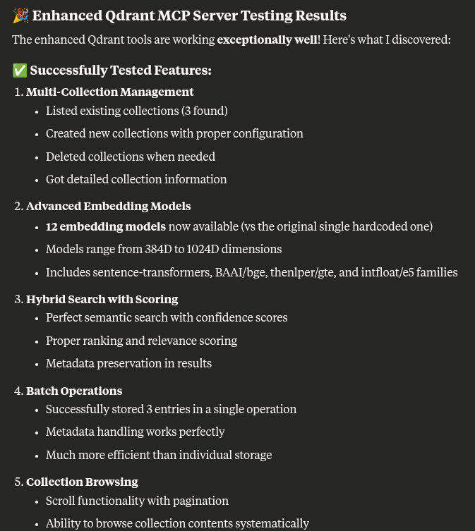

# mcp-server-qdrant-enhanced: A Qdrant MCP Server



## Overview

A Model Context Protocol server for storing and retrieving semantic memories using the Qdrant vector search engine.
It provides intelligent semantic memory with automatic embedding model management and multiple deployment modes.

## ✨ Key Features

- 🤖 **Automatic Model Selection** - No manual embedding model configuration needed
- 🔄 **Per-Collection Model Memory** - Each collection remembers its embedding model
- 🐳 **Multiple Deployment Modes** - Memory, local file, auto-managed Docker, or external
- 📊 **Advanced Search** - Hybrid search with similarity scores and filtering
- 🛠️ **Collection Management** - Create, configure, and manage collections
- 🎯 **Distance Metric Support** - Cosine, dot product, Euclidean, and Manhattan
- 📈 **Batch Operations** - Efficient bulk storage and retrieval

## Components

### Tools (13 Total)

#### Core Storage & Search
1. **`qdrant-store`** - Store information in Qdrant database
   - `information` (string): Information to store
   - `metadata` (JSON): Optional metadata
   - `collection_name` (string): Target collection (if no default set)

2. **`qdrant-find`** - Retrieve relevant information from database
   - `query` (string): Search query
   - `collection_name` (string): Collection to search (if no default set)

#### Collection Management
3. **`list_collections`** - List all available Qdrant collections
4. **`get_collection_info`** - Get detailed collection statistics and configuration
   - `collection_name` (string): Collection to inspect
5. **`create_collection`** - Create new collection with custom settings
   - `collection_name` (string): Name for new collection
   - `vector_size` (int): Vector dimensions (e.g., 384, 768, 1024)
   - `distance` (string): Distance metric (cosine, dot, euclidean, manhattan)
   - `embedding_model` (string): Optional embedding model to use
6. **`delete_collection`** - Delete collection permanently
   - `collection_name` (string): Collection to delete
   - `confirm` (bool): Required confirmation flag

#### Dynamic Embedding Models
7. **`list_embedding_models`** - List all available embedding models with specs
8. **`set_collection_embedding_model`** - Assign embedding model to collection
   - `collection_name` (string): Target collection
   - `model_name` (string): Embedding model name

#### Advanced Search & Operations
9. **`hybrid_search`** - Advanced search with similarity scores and filtering
   - `query` (string): Search query
   - `collection_name` (string): Collection to search
   - `limit` (int): Maximum results (default: 10)
   - `min_score` (float): Minimum similarity threshold
   - `include_scores` (bool): Include similarity scores in results

10. **`scroll_collection`** - Browse collection contents with pagination
    - `collection_name` (string): Collection to browse
    - `limit` (int): Entries per page (default: 20)
    - `offset` (string): Pagination offset (point ID)

11. **`batch_store`** - Store multiple entries efficiently
    - `entries` (list): List of entries with content, metadata, and optional IDs
    - `collection_name` (string): Target collection

### Resources

1. **`qdrant://collections`** - Live overview of all collections with statistics
2. **`qdrant://collection/{collection_name}/schema`** - Detailed schema and configuration for specific collection

### Supported Embedding Models

The server now supports 12+ embedding models with automatic model management:

**Compact Models (384D):**
- `sentence-transformers/all-MiniLM-L6-v2` - Lightweight, fast general use
- `sentence-transformers/all-MiniLM-L12-v2` - Better quality than L6
- `BAAI/bge-small-en-v1.5` - Optimized for English
- `thenlper/gte-small` - General text embeddings
- `intfloat/e5-small-v2` - E5 family, efficient

**Balanced Models (768D):**
- `sentence-transformers/all-mpnet-base-v2` - High quality, balanced
- `BAAI/bge-base-en-v1.5` - Better English embeddings
- `thenlper/gte-base` - General text embeddings
- `intfloat/e5-base-v2` - E5 family, balanced

**High-Quality Models (1024D):**
- `BAAI/bge-large-en-v1.5` - Highest quality English
- `thenlper/gte-large` - Large general embeddings
- `intfloat/e5-large-v2` - E5 family, highest quality

**For advanced features with 13 tools and intelligent model management, use the configuration below.**

## 🚀 Quick Start

### Deployment Modes

Choose the deployment mode that best fits your needs:

#### 🧠 Memory Mode (Fastest)
Perfect for testing and development:
```bash
export QDRANT_MODE=memory
uv run mcp-server-qdrant --transport sse
```

#### 💾 Local File Mode (Persistent)
Data persists between restarts:
```bash
export QDRANT_MODE=local
uv run mcp-server-qdrant --transport sse
```

#### 🐳 Auto-Managed Docker (Recommended)
Full Qdrant features with automatic setup:
```bash
export QDRANT_MODE=docker
export QDRANT_AUTO_DOCKER=true
uv run mcp-server-qdrant --transport sse
```

#### 🌐 External Qdrant (Production)
Connect to existing Qdrant instance:
```bash
export QDRANT_URL=http://your-qdrant-server:6333
uv run mcp-server-qdrant --transport sse
```

### Claude Desktop Configuration

Add to your `claude_desktop_config.json`:

```json
{
  "mcpServers": {
    "mcp-server-qdrant": {
      "command": "uv",
      "args": [
        "--directory",
        "/path/to/your/mcp-server-qdrant/src",
        "run",
        "mcp-server-qdrant"
      ],
      "env": {
        "QDRANT_MODE": "docker",
        "QDRANT_AUTO_DOCKER": "true",
        "QDRANT_ENABLE_COLLECTION_MANAGEMENT": "true",
        "QDRANT_ENABLE_DYNAMIC_EMBEDDING_MODELS": "true",
        "QDRANT_ENABLE_RESOURCES": "true"
      }
    }
  }
}
```

## Environment Variables

The configuration of the server is done using environment variables:

### Core Configuration
| Name                     | Description                                                         | Default Value                                                     |
|--------------------------|---------------------------------------------------------------------|-------------------------------------------------------------------|
| `QDRANT_URL`             | URL of the Qdrant server                                            | None                                                              |
| `QDRANT_API_KEY`         | API key for the Qdrant server                                       | None                                                              |
| `COLLECTION_NAME`        | Name of the default collection to use (optional for multi-collection mode) | None                                                              |
| `QDRANT_LOCAL_PATH`      | Path to the local Qdrant database (alternative to `QDRANT_URL`)     | None                                                              |
| `EMBEDDING_PROVIDER`     | Embedding provider to use (currently only "fastembed" is supported) | `fastembed`                                                       |

> [!NOTE]
> **Automatic Model Selection**: `EMBEDDING_MODEL` is no longer required. The system automatically selects appropriate models and remembers them per collection.

### Enhanced Features Configuration
| Name                                        | Description                                                  | Default Value |
|--------------------------------------------|--------------------------------------------------------------|---------------|
| `QDRANT_ENABLE_COLLECTION_MANAGEMENT`      | Enable collection management tools                           | `true`        |
| `QDRANT_ENABLE_DYNAMIC_EMBEDDING_MODELS`   | Enable dynamic embedding model assignment per collection     | `true`        |
| `QDRANT_ENABLE_RESOURCES`                  | Enable MCP resources for collection information             | `true`        |
| `QDRANT_MAX_BATCH_SIZE`                    | Maximum number of entries per batch operation               | `100`         |
| `QDRANT_SEARCH_LIMIT`                      | Default maximum search results                               | `10`          |
| `QDRANT_READ_ONLY`                         | Enable read-only mode (disables write operations)           | `false`       |
| `QDRANT_ALLOW_ARBITRARY_FILTER`            | Allow arbitrary filtering in search                         | `false`       |

### Tool Descriptions (Customizable)
| Name                                        | Description                                    | Default Value |
|--------------------------------------------|------------------------------------------------|---------------|
| `TOOL_STORE_DESCRIPTION`                   | Custom description for the store tool         | See defaults  |
| `TOOL_FIND_DESCRIPTION`                    | Custom description for the find tool          | See defaults  |
| `TOOL_BATCH_STORE_DESCRIPTION`             | Custom description for batch store tool       | See defaults  |
| `TOOL_LIST_COLLECTIONS_DESCRIPTION`        | Custom description for list collections tool  | See defaults  |
| `TOOL_CREATE_COLLECTION_DESCRIPTION`       | Custom description for create collection tool | See defaults  |
| `TOOL_DELETE_COLLECTION_DESCRIPTION`       | Custom description for delete collection tool | See defaults  |
| `TOOL_HYBRID_SEARCH_DESCRIPTION`           | Custom description for hybrid search tool     | See defaults  |
| `TOOL_SCROLL_DESCRIPTION`                  | Custom description for scroll collection tool | See defaults  |
| `TOOL_LIST_EMBEDDING_MODELS_DESCRIPTION`   | Custom description for list models tool       | See defaults  |

All tool descriptions have sensible defaults defined in [`settings.py`](src/mcp_server_qdrant/settings.py).

OLD- Note: You cannot provide both `QDRANT_URL` and `QDRANT_LOCAL_PATH` at the same time.

## Port Management

The enhanced server includes intelligent port management to avoid conflicts:

### Automatic Port Detection (Recommended)
The server automatically detects if the default port (8000) is busy and finds an alternative:

```json
{
  "env": {
    "FASTMCP_PORT": "8000"
  }
}
```

If port 8000 is busy, the server will automatically use ports 8001, 8002, etc. You'll see:
```
⚠️  Port 8000 was busy. MCP server will use port 8001
🚀 MCP Server starting on http://localhost:8001
📡 SSE endpoint: http://localhost:8001/sse
```

### Manual Port Override
To force a specific port (disables auto-detection):

```json
{
  "env": {
    "FASTMCP_PORT": "9000"
  }
}
```

### No Port Specified (Full Auto-Detection)
Omit `FASTMCP_PORT` entirely for complete automatic port assignment:

```json
{
  "env": {
    "QDRANT_URL": "http://localhost:6333"
  }
}
```

The server will scan ports 8000-8099 and use the first available port.

## Usage Examples

### Multi-Collection Workflow
```python
# List available collections
collections = await list_collections()

# Create a specialized collection for code snippets
await create_collection(
    collection_name="code_snippets",
    vector_size=768,
    distance="cosine"
)

# Create another collection for documentation
await create_collection(
    collection_name="documentation",
    vector_size=384
)

# Store data in different collections
# The system automatically selects and remembers appropriate embedding models
await store("Python function for sorting", "code_snippets")
await store("API documentation for REST endpoints", "documentation")
```

### Advanced Search with Scoring
```python
# Perform hybrid search with similarity scores
results = await hybrid_search(
    query="authentication methods",
    collection_name="documentation",
    limit=5,
    min_score=0.7,
    include_scores=True
)
```

### Batch Operations
```python
# Store multiple entries efficiently
entries = [
    {"content": "Function to validate emails", "metadata": {"type": "utility"}},
    {"content": "Database connection helper", "metadata": {"type": "database"}},
    {"content": "Error handling middleware", "metadata": {"type": "middleware"}}
]
await batch_store(entries, "code_snippets")
```

### Collection Management
```python
# Get detailed collection information
info = await get_collection_info("code_snippets")

# Browse collection contents
await scroll_collection("code_snippets", limit=10)

# View available embedding models
await list_embedding_models()

# Check which model a collection is using
# The system automatically tracks this information
```

> [!IMPORTANT]
> Command-line arguments are not supported anymore! Please use environment variables for all configuration.

### FastMCP Environment Variables

Since `mcp-server-qdrant` is based on FastMCP, it also supports all the FastMCP environment variables. The most
important ones are listed below:

| Environment Variable                  | Description                                               | Default Value |
|---------------------------------------|-----------------------------------------------------------|---------------|
| `FASTMCP_DEBUG`                       | Enable debug mode                                         | `false`       |
| `FASTMCP_LOG_LEVEL`                   | Set logging level (DEBUG, INFO, WARNING, ERROR, CRITICAL) | `INFO`        |
| `FASTMCP_HOST`                        | Host address to bind the server to                        | `0.0.0.0`     |
| `FASTMCP_PORT`                        | Port to run the server on (auto-detects if busy)          | `8000`        |
| `FASTMCP_WARN_ON_DUPLICATE_RESOURCES` | Show warnings for duplicate resources                     | `true`        |
| `FASTMCP_WARN_ON_DUPLICATE_TOOLS`     | Show warnings for duplicate tools                         | `true`        |
| `FASTMCP_WARN_ON_DUPLICATE_PROMPTS`   | Show warnings for duplicate prompts                       | `true`        |
| `FASTMCP_DEPENDENCIES`                | List of dependencies to install in the server environment | `[]`          |

## Installation- Old

**It should remain backward compatible but not sure**

### Using uvx

When using [`uvx`](https://docs.astral.sh/uv/guides/tools/#running-tools) no specific installation is needed to directly run *mcp-server-qdrant*.

```shell
QDRANT_URL="http://localhost:6333" \
COLLECTION_NAME="my-collection" \
EMBEDDING_MODEL="sentence-transformers/all-MiniLM-L6-v2" \
uvx mcp-server-qdrant
```

#### Transport Protocols

The server supports different transport protocols that can be specified using the `--transport` flag:

```shell
QDRANT_URL="http://localhost:6333" \
COLLECTION_NAME="my-collection" \
uvx mcp-server-qdrant --transport sse
```

Supported transport protocols:

- `stdio` (default): Standard input/output transport, might only be used by local MCP clients
- `sse`: Server-Sent Events transport, perfect for remote clients
- `streamable-http`: Streamable HTTP transport, perfect for remote clients, more recent than SSE

The default transport is `stdio` if not specified.

When SSE transport is used, the server will listen on the specified port and wait for incoming connections. The default
port is 8000, however it can be changed using the `FASTMCP_PORT` environment variable.

```shell
QDRANT_URL="http://localhost:6333" \
COLLECTION_NAME="my-collection" \
FASTMCP_PORT=1234 \
uvx mcp-server-qdrant --transport sse
```

### OLD- Using Docker

A Dockerfile is available for building and running the MCP server:

```bash
# Build the container
docker build -t mcp-server-qdrant .

# Run the container
docker run -p 8000:8000 \
  -e QDRANT_URL="http://your-qdrant-server:6333" \
  -e QDRANT_API_KEY="your-api-key" \
  -e COLLECTION_NAME="your-collection" \
  mcp-server-qdrant
```

### OLD- Installing via Smithery

> [!WARNING]
> **The [Smithery](https://smithery.ai/protocol/mcp-server-qdrant) installation installs the original limited version with only basic store/find functionality, not this enhanced fork with collection management and dynamic embedding models.**

To install the original basic version via Smithery:

```bash
npx @smithery/cli install mcp-server-qdrant --client claude
```

#### Single Collection Mode (Backward Compatible)

For compatibility with existing setups using a single default collection:

```json
{
  "qdrant": {
    "command": "uvx",
    "args": ["mcp-server-qdrant"],
    "env": {
      "QDRANT_URL": "https://xyz-example.eu-central.aws.cloud.qdrant.io:6333",
      "QDRANT_API_KEY": "your_api_key",
      "COLLECTION_NAME": "your-collection-name"
    }
  }
}
```
#### Local Qdrant Setup

For local development with enhanced features:

```json
{
  "mcp-server-qdrant": {
    "command": "uv",
    "args": [
      "--directory",
      "/path/to/your/mcp-server-qdrant/src",
      "run",
      "mcp-server-qdrant"
    ],
    "env": {
      "QDRANT_LOCAL_PATH": "/tmp/qdrant_storage",
      "QDRANT_ENABLE_COLLECTION_MANAGEMENT": "true",
      "QDRANT_ENABLE_DYNAMIC_EMBEDDING_MODELS": "true",
      "QDRANT_ENABLE_RESOURCES": "true"
    }
  }
}
```

This MCP server will automatically create collections and select appropriate embedding models as needed.

## Support for other tools

This MCP server can be used with any MCP-compatible client. For example, you can use it with
[Cursor](https://docs.cursor.com/context/model-context-protocol) and [VS Code](https://code.visualstudio.com/docs), which provide built-in support for the Model Context
Protocol.

### Using with Cursor/Windsurf

You can configure this MCP server to work as a code search tool for Cursor or Windsurf by customizing the tool
descriptions:

```bash
QDRANT_URL="http://localhost:6333" \
COLLECTION_NAME="code-snippets" \
TOOL_STORE_DESCRIPTION="Store reusable code snippets for later retrieval. \
The 'information' parameter should contain a natural language description of what the code does, \
while the actual code should be included in the 'metadata' parameter as a 'code' property. \
The value of 'metadata' is a Python dictionary with strings as keys. \
Use this whenever you generate some code snippet." \
TOOL_FIND_DESCRIPTION="Search for relevant code snippets based on natural language descriptions. \
The 'query' parameter should describe what you're looking for, \
and the tool will return the most relevant code snippets. \
Use this when you need to find existing code snippets for reuse or reference." \
uvx mcp-server-qdrant --transport sse # Enable SSE transport
```

In Cursor/Windsurf, you can then configure the MCP server in your settings by pointing to this running server using
SSE transport protocol. The description on how to add an MCP server to Cursor can be found in the [Cursor
documentation](https://docs.cursor.com/context/model-context-protocol#adding-an-mcp-server-to-cursor). If you are
running Cursor/Windsurf locally, you can use the following URL:

```
http://localhost:8000/sse
```

> [!TIP]
> We suggest SSE transport as a preferred way to connect Cursor/Windsurf to the MCP server, as it can support remote
> connections. That makes it easy to share the server with your team or use it in a cloud environment.

This configuration transforms the Qdrant MCP server into a specialized code search tool that can:

1. Store code snippets, documentation, and implementation details
2. Retrieve relevant code examples based on semantic search
3. Help developers find specific implementations or usage patterns

You can populate the database by storing natural language descriptions of code snippets (in the `information` parameter)
along with the actual code (in the `metadata.code` property), and then search for them using natural language queries
that describe what you're looking for.

> [!NOTE]
> The tool descriptions provided above are examples and may need to be customized for your specific use case. Consider
> adjusting the descriptions to better match your team's workflow and the specific types of code snippets you want to
> store and retrieve.

**If you have successfully installed the `mcp-server-qdrant`, but still can't get it to work with Cursor, please
consider creating the [Cursor rules](https://docs.cursor.com/context/rules-for-ai) so the MCP tools are always used when
the agent produces a new code snippet.** You can restrict the rules to only work for certain file types, to avoid using
the MCP server for the documentation or other types of content.

### Using with Claude Code

You can enhance Claude Code's capabilities by connecting it to this MCP server, enabling semantic search over your
existing codebase.

#### Setting up mcp-server-qdrant

1. Add the MCP server to Claude Code:

    ```shell
    # Add mcp-server-qdrant configured for code search
    claude mcp add code-search \
    -e QDRANT_URL="http://localhost:6333" \
    -e COLLECTION_NAME="code-repository" \
    -e EMBEDDING_MODEL="sentence-transformers/all-MiniLM-L6-v2" \
    -e TOOL_STORE_DESCRIPTION="Store code snippets with descriptions. The 'information' parameter should contain a natural language description of what the code does, while the actual code should be included in the 'metadata' parameter as a 'code' property." \
    -e TOOL_FIND_DESCRIPTION="Search for relevant code snippets using natural language. The 'query' parameter should describe the functionality you're looking for." \
    -- uvx mcp-server-qdrant
    ```

2. Verify the server was added:

    ```shell
    claude mcp list
    ```

#### Using Semantic Code Search in Claude Code

Tool descriptions, specified in `TOOL_STORE_DESCRIPTION` and `TOOL_FIND_DESCRIPTION`, guide Claude Code on how to use
the MCP server. The ones provided above are examples and may need to be customized for your specific use case. However,
Claude Code should be already able to:

1. Use the `qdrant-store` tool to store code snippets with descriptions.
2. Use the `qdrant-find` tool to search for relevant code snippets using natural language.

### Run MCP server in Development Mode

The MCP server can be run in development mode using the `mcp dev` command. This will start the server and open the MCP
inspector in your browser.

```shell
COLLECTION_NAME=mcp-dev fastmcp dev src/mcp_server_qdrant/server.py
```

### Using with VS Code

For one-click installation, click one of the install buttons below:

[](https://insiders.vscode.dev/redirect/mcp/install?name=qdrant&config=%7B%22command%22%3A%22uvx%22%2C%22args%22%3A%5B%22mcp-server-qdrant%22%5D%2C%22env%22%3A%7B%22QDRANT_URL%22%3A%22%24%7Binput%3AqdrantUrl%7D%22%2C%22QDRANT_API_KEY%22%3A%22%24%7Binput%3AqdrantApiKey%7D%22%2C%22COLLECTION_NAME%22%3A%22%24%7Binput%3AcollectionName%7D%22%7D%7D&inputs=%5B%7B%22type%22%3A%22promptString%22%2C%22id%22%3A%22qdrantUrl%22%2C%22description%22%3A%22Qdrant+URL%22%7D%2C%7B%22type%22%3A%22promptString%22%2C%22id%22%3A%22qdrantApiKey%22%2C%22description%22%3A%22Qdrant+API+Key%22%2C%22password%22%3Atrue%7D%2C%7B%22type%22%3A%22promptString%22%2C%22id%22%3A%22collectionName%22%2C%22description%22%3A%22Collection+Name%22%7D%5D) [](https://insiders.vscode.dev/redirect/mcp/install?name=qdrant&config=%7B%22command%22%3A%22uvx%22%2C%22args%22%3A%5B%22mcp-server-qdrant%22%5D%2C%22env%22%3A%7B%22QDRANT_URL%22%3A%22%24%7Binput%3AqdrantUrl%7D%22%2C%22QDRANT_API_KEY%22%3A%22%24%7Binput%3AqdrantApiKey%7D%22%2C%22COLLECTION_NAME%22%3A%22%24%7Binput%3AcollectionName%7D%22%7D%7D&inputs=%5B%7B%22type%22%3A%22promptString%22%2C%22id%22%3A%22qdrantUrl%22%2C%22description%22%3A%22Qdrant+URL%22%7D%2C%7B%22type%22%3A%22promptString%22%2C%22id%22%3A%22qdrantApiKey%22%2C%22description%22%3A%22Qdrant+API+Key%22%2C%22password%22%3Atrue%7D%2C%7B%22type%22%3A%22promptString%22%2C%22id%22%3A%22collectionName%22%2C%22description%22%3A%22Collection+Name%22%7D%5D&quality=insiders)

[](https://insiders.vscode.dev/redirect/mcp/install?name=qdrant&config=%7B%22command%22%3A%22docker%22%2C%22args%22%3A%5B%22run%22%2C%22-p%22%2C%228000%3A8000%22%2C%22-i%22%2C%22--rm%22%2C%22-e%22%2C%22QDRANT_URL%22%2C%22-e%22%2C%22QDRANT_API_KEY%22%2C%22-e%22%2C%22COLLECTION_NAME%22%2C%22mcp-server-qdrant%22%5D%2C%22env%22%3A%7B%22QDRANT_URL%22%3A%22%24%7Binput%3AqdrantUrl%7D%22%2C%22QDRANT_API_KEY%22%3A%22%24%7Binput%3AqdrantApiKey%7D%22%2C%22COLLECTION_NAME%22%3A%22%24%7Binput%3AcollectionName%7D%22%7D%7D&inputs=%5B%7B%22type%22%3A%22promptString%22%2C%22id%22%3A%22qdrantUrl%22%2C%22description%22%3A%22Qdrant+URL%22%7D%2C%7B%22type%22%3A%22promptString%22%2C%22id%22%3A%22qdrantApiKey%22%2C%22description%22%3A%22Qdrant+API+Key%22%2C%22password%22%3Atrue%7D%2C%7B%22type%22%3A%22promptString%22%2C%22id%22%3A%22collectionName%22%2C%22description%22%3A%22Collection+Name%22%7D%5D) [](https://insiders.vscode.dev/redirect/mcp/install?name=qdrant&config=%7B%22command%22%3A%22docker%22%2C%22args%22%3A%5B%22run%22%2C%22-p%22%2C%228000%3A8000%22%2C%22-i%22%2C%22--rm%22%2C%22-e%22%2C%22QDRANT_URL%22%2C%22-e%22%2C%22QDRANT_API_KEY%22%2C%22-e%22%2C%22COLLECTION_NAME%22%2C%22mcp-server-qdrant%22%5D%2C%22env%22%3A%7B%22QDRANT_URL%22%3A%22%24%7Binput%3AqdrantUrl%7D%22%2C%22QDRANT_API_KEY%22%3A%22%24%7Binput%3AqdrantApiKey%7D%22%2C%22COLLECTION_NAME%22%3A%22%24%7Binput%3AcollectionName%7D%22%7D%7D&inputs=%5B%7B%22type%22%3A%22promptString%22%2C%22id%22%3A%22qdrantUrl%22%2C%22description%22%3A%22Qdrant+URL%22%7D%2C%7B%22type%22%3A%22promptString%22%2C%22id%22%3A%22qdrantApiKey%22%2C%22description%22%3A%22Qdrant+API+Key%22%2C%22password%22%3Atrue%7D%2C%7B%22type%22%3A%22promptString%22%2C%22id%22%3A%22collectionName%22%2C%22description%22%3A%22Collection+Name%22%7D%5D&quality=insiders)

#### Manual Installation

Add the following JSON block to your User Settings (JSON) file in VS Code. You can do this by pressing `Ctrl + Shift + P` and typing `Preferences: Open User Settings (JSON)`.

```json
{
  "mcp": {
    "inputs": [
      {
        "type": "promptString",
        "id": "qdrantUrl",
        "description": "Qdrant URL"
      },
      {
        "type": "promptString",
        "id": "qdrantApiKey",
        "description": "Qdrant API Key",
        "password": true
      },
      {
        "type": "promptString",
        "id": "collectionName",
        "description": "Collection Name"
      }
    ],
    "servers": {
      "qdrant": {
        "command": "uvx",
        "args": ["mcp-server-qdrant"],
        "env": {
          "QDRANT_URL": "${input:qdrantUrl}",
          "QDRANT_API_KEY": "${input:qdrantApiKey}",
          "COLLECTION_NAME": "${input:collectionName}"
        }
      }
    }
  }
}
```

Or if you prefer using Docker, add this configuration instead:

```json
{
  "mcp": {
    "inputs": [
      {
        "type": "promptString",
        "id": "qdrantUrl",
        "description": "Qdrant URL"
      },
      {
        "type": "promptString",
        "id": "qdrantApiKey",
        "description": "Qdrant API Key",
        "password": true
      },
      {
        "type": "promptString",
        "id": "collectionName",
        "description": "Collection Name"
      }
    ],
    "servers": {
      "qdrant": {
        "command": "docker",
        "args": [
          "run",
          "-p", "8000:8000",
          "-i",
          "--rm",
          "-e", "QDRANT_URL",
          "-e", "QDRANT_API_KEY",
          "-e", "COLLECTION_NAME",
          "mcp-server-qdrant"
        ],
        "env": {
          "QDRANT_URL": "${input:qdrantUrl}",
          "QDRANT_API_KEY": "${input:qdrantApiKey}",
          "COLLECTION_NAME": "${input:collectionName}"
        }
      }
    }
  }
}
```

Alternatively, you can create a `.vscode/mcp.json` file in your workspace with the following content:

```json
{
  "inputs": [
    {
      "type": "promptString",
      "id": "qdrantUrl",
      "description": "Qdrant URL"
    },
    {
      "type": "promptString",
      "id": "qdrantApiKey",
      "description": "Qdrant API Key",
      "password": true
    },
    {
      "type": "promptString",
      "id": "collectionName",
      "description": "Collection Name"
    }
  ],
  "servers": {
    "qdrant": {
      "command": "uvx",
      "args": ["mcp-server-qdrant"],
      "env": {
        "QDRANT_URL": "${input:qdrantUrl}",
        "QDRANT_API_KEY": "${input:qdrantApiKey}",
        "COLLECTION_NAME": "${input:collectionName}"
      }
    }
  }
}
```

For workspace configuration with Docker, use this in `.vscode/mcp.json`:

```json
{
  "inputs": [
    {
      "type": "promptString",
      "id": "qdrantUrl",
      "description": "Qdrant URL"
    },
    {
      "type": "promptString",
      "id": "qdrantApiKey",
      "description": "Qdrant API Key",
      "password": true
    },
    {
      "type": "promptString",
      "id": "collectionName",
      "description": "Collection Name"
    }
  ],
  "servers": {
    "qdrant": {
      "command": "docker",
      "args": [
        "run",
        "-p", "8000:8000",
        "-i",
        "--rm",
        "-e", "QDRANT_URL",
        "-e", "QDRANT_API_KEY",
        "-e", "COLLECTION_NAME",
        "mcp-server-qdrant"
      ],
      "env": {
        "QDRANT_URL": "${input:qdrantUrl}",
        "QDRANT_API_KEY": "${input:qdrantApiKey}",
        "COLLECTION_NAME": "${input:collectionName}"
      }
    }
  }
}
```

## Contributing

If you have suggestions for how mcp-server-qdrant could be improved, or want to report a bug, open an issue!
We'd love all and any contributions.

### Testing `mcp-server-qdrant` locally

The [MCP inspector](https://github.com/modelcontextprotocol/inspector) is a developer tool for testing and debugging MCP
servers. It runs both a client UI (default port 5173) and an MCP proxy server (default port 3000). Open the client UI in
your browser to use the inspector.

```shell
QDRANT_URL=":memory:" COLLECTION_NAME="test" \
fastmcp dev src/mcp_server_qdrant/server.py
```

Once started, open your browser to http://localhost:5173 to access the inspector interface.

## License

This MCP server is licensed under the Apache License 2.0. This means you are free to use, modify, and distribute the
software, subject to the terms and conditions of the Apache License 2.0. For more details, please see the LICENSE file
in the project repository.

## 🤖 How Automatic Model Selection Works

The server features **intelligent automatic model selection**:

1. **First Use**: When you first store data in a collection, the server uses a default embedding model
2. **Model Recording**: The server automatically records which model was used for that collection
3. **Consistency**: All future operations on that collection use the same exact model
4. **Per-Collection**: Each collection can use a different model based on its specific needs
5. **Distance Tracking**: Each collection also remembers its distance metric (cosine, dot, euclidean, manhattan)
6. **No Configuration**: No need to manually specify embedding models in your config

This ensures **perfect consistency** - each collection always uses the same embedding model it was created with, preventing dimension mismatches and maintaining semantic coherence.

### Auto-Managed Docker Features

When using `QDRANT_MODE=docker` with `QDRANT_AUTO_DOCKER=true`:

- 🔍 **Smart Container Detection** - Checks if Qdrant container already exists
- 🔄 **Port Conflict Resolution** - Automatically finds available ports
- 💾 **Data Persistence** - Mounts `./qdrant_data` for persistent storage
- 🧹 **Graceful Cleanup** - Stops container when server exits
- ⚡ **Health Checking** - Waits for Qdrant API to be ready before proceeding
